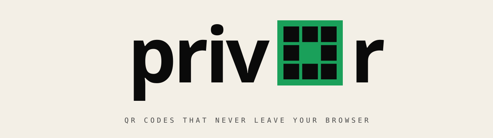

<!-- Hero -->
<p align="center">
  <picture>
    <source media="(prefers-color-scheme: dark)" srcset="./assets/banner-dark.svg" />
    
  </picture>
</p>

<p align="center">
  <a href="https://pws-wobbuffet.github.io/privqr/">
    
  </a>
  
  
  
  
</p>

---

> **A QR code generator that never sees your data.**
> Your WiFi password is yours. So is the URL of that draft Google Doc you're sharing at a meeting. They shouldn't pass through someone else's logs just because you wanted a QR code.

Most QR generators send your URLs, WiFi passwords, and contact info through their servers. **privqr doesn't.** Everything happens in your browser — no server, no account, nothing uploaded. Open the page, **pull the network plug, it still works.**

```
$ curl privqr.app
> nothing here. we don't have a backend. by design.
```

<br />

## ▣  01 · WHAT IT DOES

```
┌─ INPUT ────────────────────────────┬─ OUTPUT ───────────────────────────┐
│  URL · text                        │  PNG  (raster, transparent-ready)  │
│  WiFi credentials  (SSID + key)    │  SVG  (vector, infinite scale)     │
│  vCard contacts                    │                                    │
│  Geographic locations  (lat/lon)   │  Embed: logo · custom colors       │
│  Email · SMS · Phone               │  Style: dots · corners · ECC       │
└────────────────────────────────────┴────────────────────────────────────┘
```

- Generate QR codes for **URL/text, WiFi credentials, vCard, geographic locations, email, SMS, and phone numbers**
- Customize **colors, dot/corner styles, and embed a logo** in the center
- Download as **PNG** or **SVG** (vector)
- Available in **English, Spanish, Portuguese, French** — auto-detected from your browser
- **100% client-side:** open the page, disconnect from the internet, it still works

<br />

## ▣  02 · WHY

|       | Other QR generators        | **privqr**               |
| ----- | -------------------------- | ------------------------ |
| Where the data goes | Their server | Your browser. That's it. |
| Account required    | Often        | Never                    |
| Analytics / tracking| Usually      | None                     |
| Works offline       | No           | Yes                      |
| Backend             | Yes          | There isn't one          |

The QR spec is a public, open standard. Generating one is just math. There's no reason to phone home for math.

<br />

## ▣  03 · RUN LOCALLY

```bash
git clone https://github.com/pws-wobbuffet/privqr.git
cd privqr
pnpm install
pnpm dev
# → open http://localhost:4321/privqr/
```

Build for production:

```bash
pnpm build      # static export → ./dist
pnpm preview    # serve the build locally
```

<br />

## ▣  04 · STACK

```
Astro 6 ──────── build-time bundling, zero-runtime transpiler
React 18 ─────── interactive UI islands
qr-code-styling  rendering · logo embedding · PNG/SVG export
GitHub Pages ─── static hosting via GitHub Actions
```

**No tracking. No analytics. No backend.** Just static files served from a CDN.

<br />

## ▣  05 · CONTRIBUTING

PRs welcome — **especially translations.** Each language lives in `src/lib/i18n.js`. Add your locale, open a PR, done.

See [CONTRIBUTING.md](./CONTRIBUTING.md) for the full playbook.

```
good first issues  →  github.com/pws-wobbuffet/privqr/labels/good%20first%20issue
translations       →  src/lib/i18n.js
bug reports        →  github.com/pws-wobbuffet/privqr/issues
```

<br />

## ▣  06 · LICENSE

[**MIT**](./LICENSE) — do whatever, just don't sue us.

<br />

---

<p align="center">
  <sub>Made for humans · No servers harmed in the making of this software.</sub>
</p>
